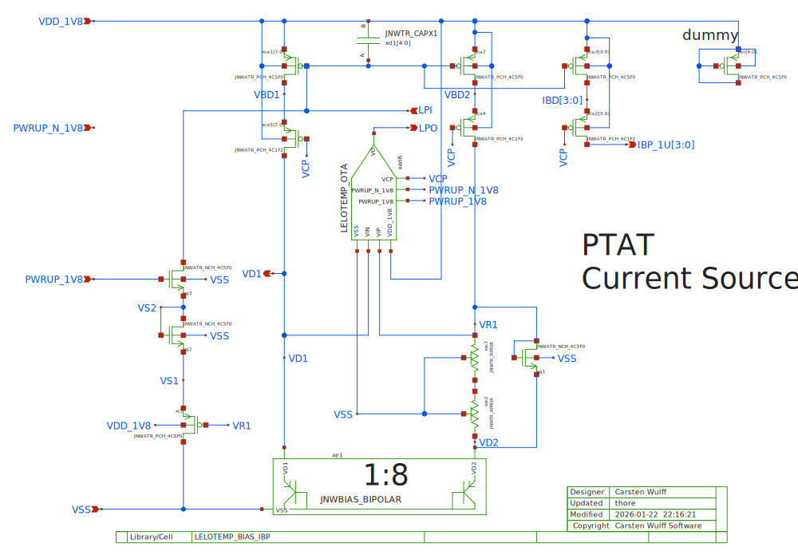
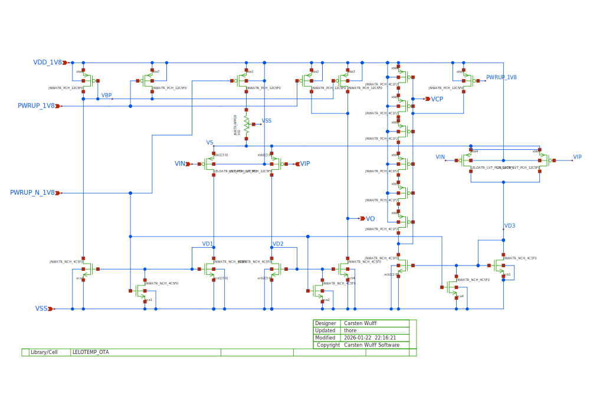
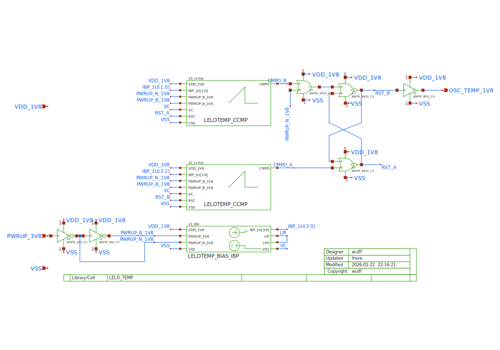
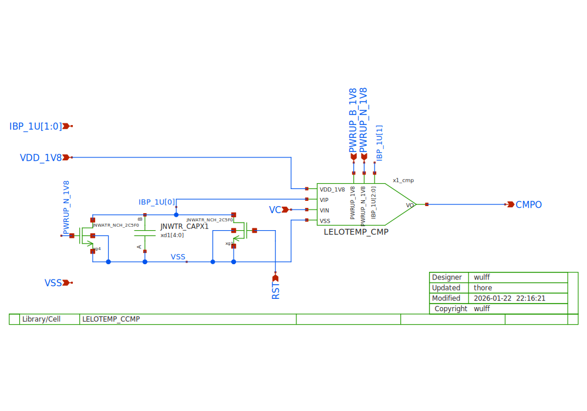
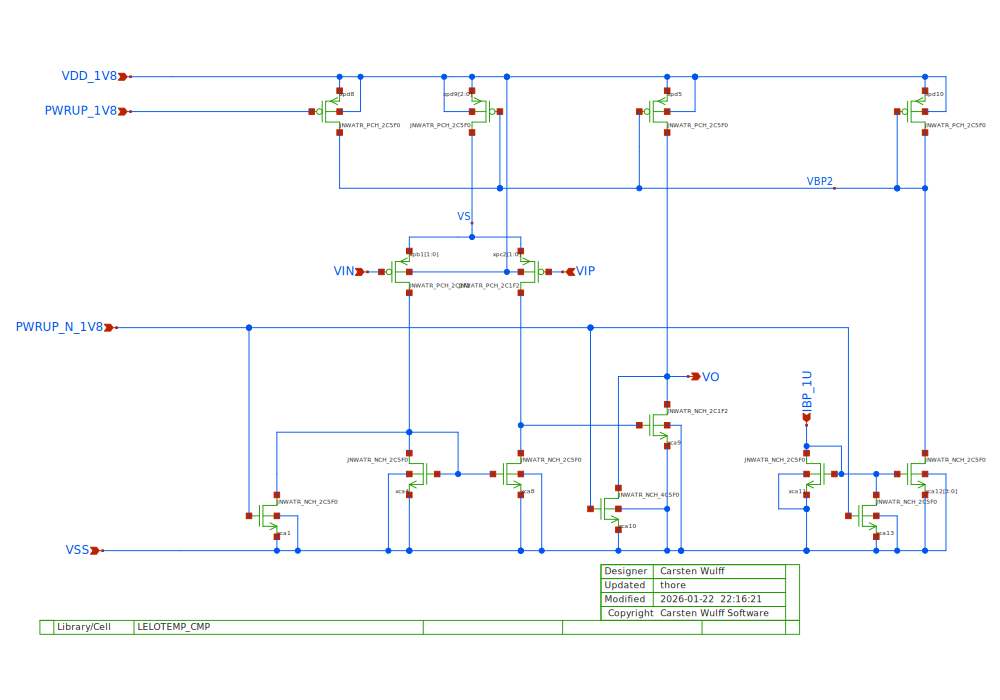
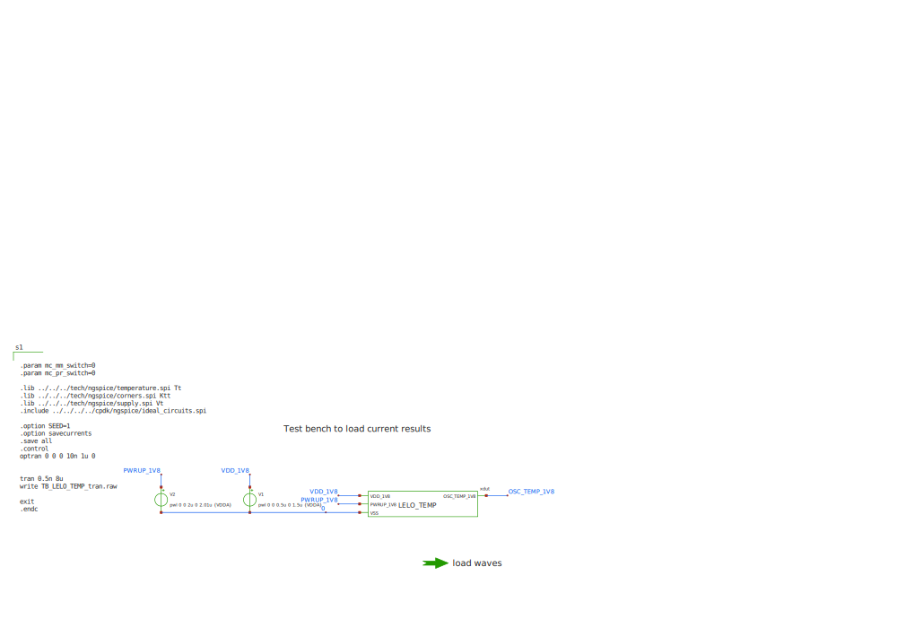

* TOC
{:toc }

## LELO_TEMP_SKY130A

### LELOTEMP_BIAS_IBP

Bandgap core. The voltage across the resistor between VR1 and VD2 will be

$$ \Delta V = V_{R1} - V_{D2} = \frac{k T}{q} ln(8 \times 8) $$

since there is a 1-to-8 ratio between the bipolars, and a 1-to-8 ratio in the
current mirror.

The current in the resistor will be

$$ I_{R} = \frac{\Delta V}{(4 + 8) \times RPPO}$$

Where $RPPO$ is the unit resistor.

The $V_C$ is a bit more complicated, but can be calculated to be 

$$ V_C = \frac{kT}{q}(\ell  - 3 \ln T) + V_G $$ 

where

$$ \ell= \ln{I_D} - \ln{\left (Aq\frac{D_n}{L_n N_A} +
\frac{D_p}{L_p N_D}\right)}  - 2 \ln{\sqrt{B_c B_v}} $$

where $A$ is the area of the diode, $I_D$ the current in the diode, $D_n,D_p$ are the diffusion constants for
electrons and holes. $L_n,L_p$ are the diffusion lengths, $N_A,N_D$ are the
acceptor and donor concentration.  and $B_c,B_v$ are

$$ B_c = 2 \left[\frac{2 \pi  k m_n^*}{h^2}\right]^{3/2} \text{  } B_v = 2
\left[\frac{2 \pi  k m_p^*}{h^2}\right]^{3/2} $$

where $m_n,m_p$ are the effective mass of electrons and holes and $h$ is
Planck's constant.

Obviously. 

Not really. 

But it is understandable. 

See [Diodes](https://analogicus.com/aic2026/2024/10/25/Diodes.html#forward-voltage-temperature-dependence)

Estimated values from the model in [LELO\_TEMP.py](py/LELO_TEMP.py) are shown in table below.

| Temperature [C] | Current [uA] | Vc [V] | DeltaV [mV] |
|-----------------|--------------|--------|-------------|
| -40             | 0.902        | 0.8386 | 83.6        |
| 25              | 1.133        | 0.7412 | 106.9       |
| 125             | 1.470        | 0.5844 | 142.7       |

The table was generated from [model.ipynb](model.ipynb)

The startup circuit on the left side will ensure that the LPI node is pulled
down when the circuit starts up. The PWRUP will enable the NMOS between LPI and
VS2. The diode connected NMOS between VS1 and VS2 lmits the current.  The PMOS
will eventually turn off the startup path when VR1 is high enough.

The diode connected transistor on the right side is to clamp the voltage between
VR1 and VD2. If the current is too high, then a high voltage on VR1 can turn off
the PMOS in the OTA, and increase settling time.

 

### LELOTEMP_OTA

Current mirror OTA. The bias is provided by the resistor from the tail of the
differential pair to VDD. I'm not using the bias current from the bandgap
because I don't want to complicate the loop startup behavior. 

The output of the OTA is pull high in power down to ensure that the PMOS current
mirror in the bandgap is turned off in power down.

The circuit on the right side is used to generate the cascode bias for the main
bandgap. 

 

### LELO_TEMP
Bandgap (LEOTEMP\_BIAS\_IPB) is used to provide a PTAT current for the frequency
conversion and the comparator. The $V_C$ is the CTAT diode voltage in the bandgap.
The output current is approximately 1 uA.

The current charges the capacitor inside CCMP. When the voltage on the capacitor reaches $V_C$
the comparator inside CCMP will trigger (low to high).

The two comparators alternate to trigger the set/reset latch made by the NOR
gates. As such, the two capacitors are alternatively charged.

The output frequency can be calculated from the voltage/current relationship of
a capacitor. 

A single charge cycle is given by 

$$ I = C \frac{dV}{dt}  \Rightarrow dt = C \frac{V_C}{I} $$

Inserting for the bandgap current ($I_R$)

$$ dt = RC \frac{V_C}{\Delta V} $$

As such, the frequency will be 

$$ f_{OSC} = \frac{1}{2 dt} = \frac{1}{2RC} \frac{\Delta V}{V_C} $$

The $\Delta V$ increases with temperature and $V_C$ decreases with temperature,
turns out the $\Delta V$ increases faster than $V_C$ drops, so the overall
gradient is positive.

The estimated frequency is shown in the table below (the table was generated from [model.ipynb](model.ipynb)))

| Temperature [C] | Frequency [MHz] |
|-----------------|-----------------|
| -40             | 1.858           |
| 25              | 2.634           |
| 125             | 4.310           |

 

### LELOTEMP_CCMP

 

### LELOTEMP_CMP

A two-stage OTA used as comparator. Uses a 1U bias current from the bandgap

 

### TB_LELO_TEMP
A top level debug testbench for the temperature sensor. If you open the
testbench in Xschem you'll see there are waveforms to view signals inside the
temperature sensor. 

A debug testbench like this is quite useful to figure out what's going on, and
see what voltages and currents are present in the design.

 

